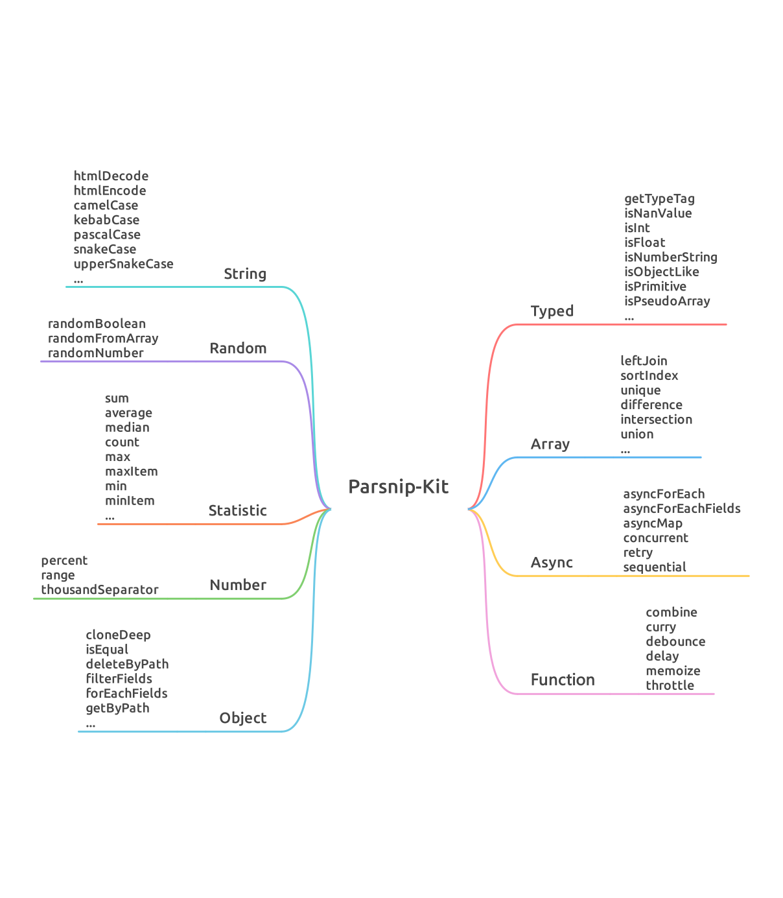

# Parsnip-Kit とは？

Parsnip-Kit は、ゼロディペンダシ、マルチファンクション、モジュラライズされた JavaScript ユーティリティライブラリで、TypeScript をサポートしています。

このライブラリは、型チェック、配列、オブジェクト、文字列、関数、非同期処理、数値、統計、ランダムなど、開発におけるほとんどのニーズをカバーするツール関数を提供します。これにより、アプリケーションにおけるテンプレートコードを削減し、保守性を向上させることができます。

Parsnip-Kit は、モダンな JavaScript API を使用して書かれており、すべてのツール関数が TypeScript の型定義をサポートしています。アプリケーションの開発やソースコードの閲覧において、開発者に快適な体験を提供します。

# 概要

以下は Parsnip-Kit が提供するツール関数の概要です。

